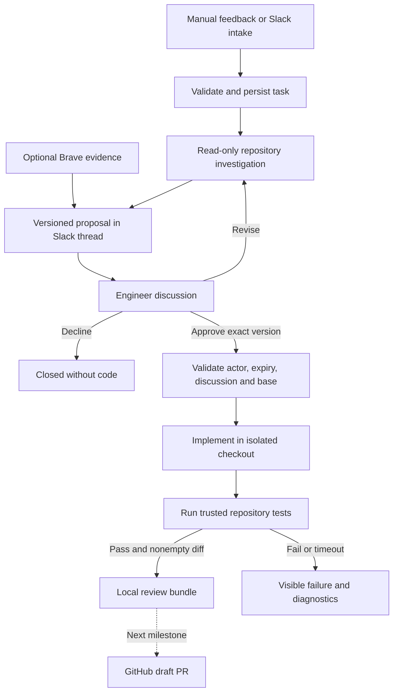

# Auto Iteration: first working product

## Product promise

A business connects a feedback source, its engineering conversation, and an approved repository. Auto Iteration turns a specific customer problem into a code-backed proposal. Engineers discuss and revise it, an authorized engineer approves an exact version, and the system prepares a tested change for code review.

The first success metric is **one feedback item → one useful discussion → one approved proposal → one reviewable code change**. A patch proves the local engineering loop; a GitHub draft PR completes the connected product milestone. Neither implies that the fix is merged, shipped, or verified with customers.

## Initial customer and scope

- A small software team with one customer-facing application and a Slack workspace.
- One configured organization, repository, base branch, Slack channel, and list of approvers.
- Feedback begins as a manually entered support ticket or exported JSON record. The local Demo CRM endpoint accepts JSON at `POST /api/feedback`. Slack intake accepts `@bot feedback <report>`.
- Each report has a stable source ID, original text, title, and a linked task. Never discard separate customer reports just because the wording matches.
- One task gets one Slack thread. Engineers can discuss there without being separate AI agents.
- Code changes require concrete acceptance criteria. Vague reports need clarification; non-code problems remain business/product decisions.
- Initially produce a local branch, patch, test log, and review summary. Add remote draft PRs after the connected loop is validated.

## Stack decisions

| Layer | Decision | Reason |
| --- | --- | --- |
| Application | TypeScript on Node.js 22.20+ | Shared types and SDKs across the workflow |
| Conversation | Slack Bolt, Socket Mode | Official group/channel events; local development without an inbound public Slack endpoint |
| Orchestration | Inngest over persistent application jobs | Dispatch, delivery retries, visibility; business state remains durable in our database |
| Database | SQLite for one host; Postgres before multiple workers/tenants | A small local setup now and a clear scaling boundary |
| Code executor | Codex SDK | Use an existing coding harness for investigation and implementation |
| Research | Brave Search | Explicit technical searches, source links retained with findings |
| Git integration | Local Git first; GitHub App for customer installation later | Separate change preparation from remote publication |
| Hosting | Local processes for the first milestone | No deployment or hosting accounts required to prove the loop |

Slack supports Socket Mode without a public request URL; Bolt handles the connection. [Slack documentation](https://docs.slack.dev/apis/events-api/using-socket-mode/)

The Codex SDK supports programmatic local coding sessions. We currently use separate read-only investigation and write-enabled implementation sessions, passing the versioned plan between them. This keeps the state in our application instead of relying on a conversation ID alone. [Official OpenAI documentation](https://learn.chatgpt.com/docs/codex-sdk)

## Agent responsibilities

These are roles in one backend, not five separately deployed services.

| Role | Responsibility | MVP implementation |
| --- | --- | --- |
| Lead/orchestrator | Route work and enforce the state machine | Deterministic application code; an LLM never grants approval |
| Feedback specialist | Preserve original evidence, later group themes and suggest priority | Validated intake and exact delivery deduplication; semantic grouping deferred |
| Web specialist | Find public documentation and upstream issue evidence | Explicit Brave query through CLI; snippets are labeled unverified |
| Engineering specialist | Inspect code, propose a fix, implement approved changes | Scripted fixture or live Codex provider |
| Conversational specialist | Keep discussion and proposed scope aligned | Slack discussion and explicit revise commands first; open-ended Q&A later |

## End-to-end behavior

### Review contract

Every proposal contains a disposition, summary, code evidence, implementation steps, acceptance criteria, version, base commit, expiry, and the count of discussion messages incorporated into it. The team can inspect the exact plan before approval.

Approval records the actor, plan version, and timestamp. Only configured Slack user IDs can approve. Local CLI commands explicitly trust the operator. A message inside a review saying “approved” is just customer text. An LLM recommendation is never authorization.

Any new recorded discussion requires a revised proposal before approval. This is intentionally conservative for the first version. A declined or expired proposal cannot silently proceed. An implementation cannot broaden its own permissions, merge, or deploy.

### Durable execution

The database commits an approval and its pending implementation job in the same transaction. The Inngest dispatcher repeatedly sends pending jobs using stable event IDs. Workers atomically claim jobs; duplicate delivery cannot cause a second coding run.

We use separate investigation and implementation events instead of holding a process or a single event listener open during discussion. A fast approval is persisted even if the next worker has not started. Inngest also supports `waitForEvent()` for human approval workflows, but that primitive is not needed in this initial database-backed design. [Inngest documentation](https://www.inngest.com/docs/ai-patterns/human-in-the-loop)

Failed or interrupted coding attempts are not automatically replayed. Recovery preserves their workspace for inspection, then requires a new proposal and approval. This avoids repeating an operation whose side effects are uncertain.

## Build order and acceptance criteria

### Milestone 1 — executable local foundation (implemented and locally verified)

- Validated feedback intake, durable tasks/jobs, and audit history.
- Explicit engineer comments, revised proposals, and authorized version-specific approval.
- Separate checkout, code edit, regression tests, patch, and review summary.
- Keyless scripted fixture that demonstrates the complete loop honestly.
- Tests for critical failure and concurrency cases.

**Done when:** `npm run demo`, `npm run check`, and `npm test` pass. The demo must reproduce the original bug, fix it in another checkout, and show the original working tree is clean.

### Milestone 2 — one connected team and one real repository (adapters written; live validation pending)

1. Create our Slack app from the manifest; configure the workspace, channel, and approver IDs.
2. Connect a trusted demo repository and configure Codex authentication and its test/setup requirements.
3. Run one real feedback investigation, discuss it in Slack, revise, approve, and inspect its generated patch.
4. Exercise rejection, expired plan, missing dependencies, delayed Slack events, and failed tests with the connected accounts.
5. Connect Inngest and verify delivery/restart behavior against its local development server, then choose hosting for long-running code jobs.
6. Add optional Brave research and verify quoted claims by retrieving source pages, not relying only on snippets.

**Done when:** actual engineers in Slack complete a real model-backed investigation and implementation on a trusted repository. The default scripted demo does not count as this milestone.

### Milestone 3 — GitHub draft PR delivery and a pilot feedback source

1. Install a GitHub App on selected repositories. Grant the minimum permissions needed for contents and pull requests; do not request administration by default. [GitHub permissions](https://docs.github.com/en/apps/creating-github-apps/registering-a-github-app/choosing-permissions-for-a-github-app)
2. Keep repository credentials in the publisher rather than in model prompts or test subprocesses.
3. Recheck the current remote base and bind publication to the approved plan and tested diff.
4. Use a deterministic task/plan branch name. If a push or PR request times out, look up the existing branch/PR before retrying.
5. Open a draft PR with the feedback link, approved plan, scope, actual tests, and uncertainty. Post its link in the original Slack thread.
6. Add one feedback connector selected with the pilot customer, such as support-ticket exports or a documented helpdesk webhook. Validate webhook authenticity, IDs, and delivery retries.

**Done when:** one real customer report yields a real draft PR with passing checks and a traceable approval. Merge/deploy stays with the engineering team.

### Later — business and enterprise requirements

Semantic clustering with source traceability; severity and business-impact prioritization; multiple teams/repositories; Slack OAuth onboarding; richer conversational Q&A; dedicated runner containers; Postgres and tenant isolation; secret management; retention/deletion controls; cancellation and quotas; remote CI validation; rollout and customer outcome tracking.

Do not start with dashboards, WhatsApp/RCS/iMessage integrations, automatic deployments, or an unrestricted agent network.

## Edge cases and implementation decisions

| Issue | Current handling / required next step |
| --- | --- |
| The same webhook arrives twice | Unique organization/source/external ID returns the existing task; conflicting payload rejected |
| Many customers report the same bug | Preserve separate reports; grouping is a later derived view, not destructive deduplication |
| Spam or a misleading review | Keep evidence; do not claim text alone can establish authenticity; human triage before pilot automation |
| Feedback is vague or not a coding issue | Proposal disposition blocks code approval until clarified; engineers may decline |
| Approval refers to v1 after v2 was prepared | Reject stale version |
| New discussion is not included in the proposal | Require revise before approval |
| An unauthorized engineer or customer says “approve” | Only explicit commands by a configured approver authorize work |
| Approve is delivered twice | Approval and job claims are idempotent |
| Base branch changed | Stop and request a fresh proposal/approval; remote ref checks are required for the publisher milestone |
| Worker crashes or machine sleeps | Persist queue/history; conservatively recover dead-process jobs without automatic implementation replay |
| Tests fail, time out, or are missing dependencies | Mark failed with diagnostics; never claim tests passed or a PR exists |
| Tests pass despite a bad fix | Human code review remains necessary; add meaningful acceptance tests and independent CI before pilot rollout |
| Agent reports a blocker or changes Git history | Fail the operation; preserve evidence for human inspection |
| The report contains prompt injection | Treat it as evidence, restrict authority to application code; prompt instructions are not a complete sandbox |
| Source code/PII sent to search or the model | Brave receives only an explicit query; model context follows the configured model provider's data path; add data policy and redaction before customers |
| Slack events arrive out of order or old messages are edited | Known adapter limitation; reconcile thread state/message revisions before live approval rollout |
| Slack notification times out after being posted | Retry may duplicate a notification; it must not duplicate the code job; persisted receipts cover confirmed sends |
| Wrong tenant or repository is selected | Scope lookups by organization and bind tasks to a configured repository identity; one-tenant MVP is not a complete isolation guarantee |
| Repository setup or tests execute malicious code | Local clones do not sandbox processes; use trusted demo repos now and restricted execution containers before customer repos |
| Private runner is pitched as keeping all source private | Do not make that promise automatically: the coding model may receive repository context even when execution is local |
| No response from engineers | Proposals expire after 24 hours; never auto-approve |
| People want to cancel during implementation | Not exposed yet; stop the worker, preserve the checkout, recover, and inspect. Add explicit cancellation before team rollout |

## Decisions needed for the connected milestone

- Which Slack workspace/channel will host the pilot, and which engineers can approve?
- Which separate application repository has a reproducible issue and a known test command?
- Which feedback source does the pilot business already use?
- Which model authentication and code/data-sharing policy applies?

These choices do not block the local demonstration or the architecture in this repository.
